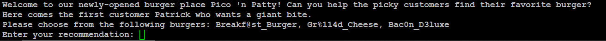
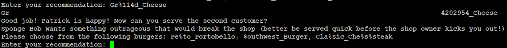

# format string 0
## Challenge tags:
- Easy
- Binary Exploitation 
- picoCTF 2024

## Challenge author: CHENG ZHANG
## Challenge description:
Can you use your knowledge of format strings to make the customers happy?

## Solution
First we have to connect to server using netcat. Adress will be shown after running challenge.

We probably have to just select a burger. But which one? Every position in a menu have special characters in their names. Challenge name tells us that this is about string formating, so maybe those special signs have meaning?
After searching the internet i found [this site](https://www.geeksforgeeks.org/format-specifiers-in-c/). We can see that every format specifier begin with **%**, and **Gr%114d_Cheese** have this sign in it. Lets select it.

Now two menu positions have **%** sign in their names. Lets look at the table of format specifiers to find **%t** and **%s**. Only **%s** exist in this table, so lets select **Cla%sic_Che%s%steak**.

And thats it, we have our flag. 
