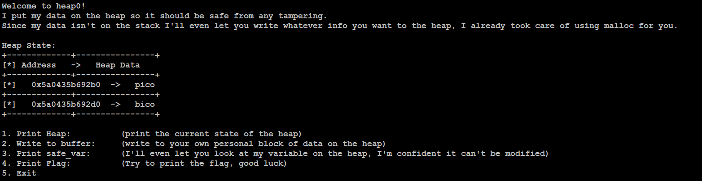
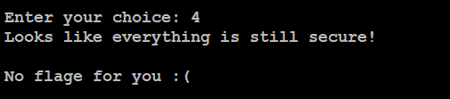
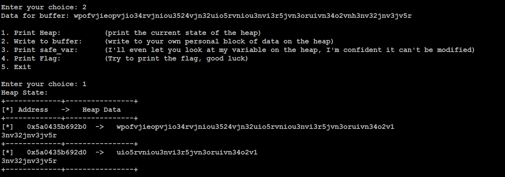

# heap 0
## Challenge tags:
- Easy
- Binary Exploitation
- picoCTF 2024
- browser_webshell_solvable
- heap

## Challenge author: ABRXS, PR1OR1TYQ
## Challenge description:
Are overflows just a stack concern?

## Solution
Lets connect to the remote machine using netcat. We see a few options, and second one is telling us that we can write whatever we want to the heap. I recommend watching [this](https://youtu.be/gRwfHzeS-GM?si=yO9kDAAB7IbjVv4n) to learn something about memory.

Printing our Flag is not available right now. 

Now its time to overflow this heap. Select second option, hit your keyboard multiple times and press enter. 

Thats exacly how heap overflow attack works. We broke something in data structure, but now we can print our flag ;]

