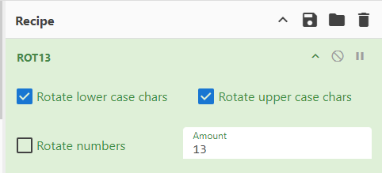

# Mod 26
## Challenge tags:
- Easy
- Cryptography
- picoCTF 2021

## Challenge author: PANDU
## Challenge description:
Cryptography can be easy, do you know what ROT13 is? 

cvpbPGS{arkg_gvzr_V'yy_gel_2_ebhaqf_bs_ebg13_uJdSftmh}

## Solution
ROT13 is a case of Caesar Cipher where you have to rotate by 13 places instead of 3.

I recommend using [CyberChef](https://gchq.github.io/CyberChef/)

This recipe will give you a flag.

