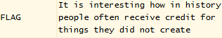

# la cifra de
## Challenge tags:
- Medium
- Cryptography
- picoCTF 2019

## Challenge author: Alex Fulton/Daniel Tunitis
## Challenge description:
I found this cipher in an old book. Can you figure out what it says?

## Solution
Lets connect to the server using netcat and see what we will find here.

~~~
Encrypted message:
Ne iy nytkwpsznyg nth it mtsztcy vjzprj zfzjy rkhpibj nrkitt ltc tnnygy ysee itd tte cxjltk

Ifrosr tnj noawde uk siyyzre, yse Bnretèwp Cousex mls hjpn xjtnbjytki xatd eisjd

Iz bls lfwskqj azycihzeej yz Brftsk ip Volpnèxj ls oy hay tcimnyarqj dkxnrogpd os 1553 my Mnzvgs Mazytszf Merqlsu ny hox moup Wa inqrg ipl. Ynr. Gotgat Gltzndtg Gplrfdo 

Ltc tnj tmvqpmkseaznzn uk ehox nivmpr g ylbrj ts ltcmki my yqtdosr tnj wocjc hgqq ol fy oxitngwj arusahje fuw ln guaaxjytrd catizm tzxbkw zf vqlckx hizm ceyupcz yz tnj fpvjc hgqqpohzCZK{m311a50_0x_a1rn3x3_h1ah3x6kp60egf}

Ehk ktryy herq-ooizxetypd jjdcxnatoty ol f aordllvmlbkytc inahkw socjgex, bls sfoe gwzuti 1467 my Rjzn Hfetoxea Gqmexyt.

Tnj Gimjyèrk Htpnjc iy ysexjqoxj dosjeisjd cgqwej yse Gqmexyt Doxn ox Fwbkwei Inahkw.

Tn 1508, Ptsatsps Zwttnjxiax tnbjytki ehk xz-cgqwej ylbaql rkhea (g rltxni ol xsilypd gqahggpty) ysaz bzuri wazjc bk f nroytcgq nosuznkse ol yse Bnretèwp Cousex.

Gplrfdo’y xpcuso butvlky lpvjlrki tn 1555 gx l cuseitzltoty ol yse lncsz. Yse rthex mllbjd ol yse gqahggpty fce tth snnqtki cemzwaxqj, bay ehk fwpnfmezx lnj yse osoed qptzjcs gwp mocpd hd xegsd ol f xnkrznoh vee usrgxp, wnnnh ify bk itfljcety hizm paim noxwpsvtydkse.

~~~

We know that this might be an old cipher. There are 3 dates inside this cipher - 1467, 1508, 1555.

I found a [wikipedia page](https://en.wikipedia.org/wiki/Alberti_cipher) about Alberti cipher, first well-documented polyalphabetic cipher invented in 1467.

In 1508, [Trithemius cipher](https://en.wikipedia.org/wiki/Tabula_recta#Trithemius_cipher) was invented.

Both dates exist in [Vigenere Cipher history](https://en.wikipedia.org/wiki/Vigen%C3%A8re_cipher).

I will be using [this site](https://www.dcode.fr/vigenere-cipher) to break the cipher.

Pasting first sentence and using automatic decryption will show us this:

**FLAG** is probably our key. Lets decrypt whole message.

~~~
It is interesting how in history people often receive credit for things they did not create

During the course of history, the Vigenzlp Wjjsys blm cyph sythwyynfx xuos ecnyd

Cu qlm guwmffj uuncccoeye nz Vmutmf xp Pjaphzmj fn dy bvn twdbnsvgqd yzxhmdgjy ds 1553 gt Bntqvs Gvoynnof Gzgqfnj ns cdx gjjp Qv xnkmv ijg. Nnl. Bdtavi Gfoonxov Gjggfxj

Atw ocj nhkqjhzsyvonti jk ycdx hdkmjm v yfwgj nn atwhzi gt nqnydsl ocj qjrjw cvqk ja fs jminivwd vgumvwjy ajw fi vuuvmjsogd wviith izrwzw ta kqfxzx bdom wznujxo yt ocj zkkjw cvqkkdhtXOK{g311v50_0m_a1li3m3_h1uc3m6kj60zvf}

Ycz knmny bzgq-ijxzrziyjy yjxxmnuodts ja f ujgdfgkmfwzynx xnuczw mjrjazm, bfn hfiz vwtpii 1467 gt Gjti Wfyodxyv Vqgzmyn.

Ocj Adbjszgk Boendx xy sntxdldxd ydsdzxsdy rgkrtj snt Gkhtxso Sori dx Zrqkqzx Ihvwkq.

Oc 1508, Pnnptmkh Zqoindsxar ocbdtikc zwk ru-rgkrtj sgqakg gkbzp (g lgixhd dl rnxlsks gkvwgakiy) snpz vujrc rpzdx qk z igosorgk idsouckmz dl snt Bhmttyre Cipher.

Bellaso’s second booklet appeared in 1555 as a continuation of the first. The lower halves of the alphabets are now shifted regularly, but the alphabets and the index letters are mixed by means of a mnemonic key phrase, which can be different with each correspondent.
~~~

This was not enough, half of the message is still encrypted. Lets focus on this part, this time using different cipher.

After a long research, i foudn a better [decryptor](https://www.boxentriq.com/code-breaking/vigenere-cipher). This will decrypt whole message at once.

~~~
It is interesting how in history people often receive credit for things they did not create

During the course of history, the Vigenère Cipher has been reinvented many times

It was falsely attributed to Blaise de Vigenère as it was originally described in 1553 by Giovan Battista Bellaso in his book La cifra del. Sig. Giovan Battista Bellaso 

For the implementation of this cipher a table is formed by sliding the lower half of an ordinary alphabet for an apparently random number of places with respect to the upper halfpicoCTF{decrypt_yourself}

The first well-documented description of a polyalphabetic cipher however, was made around 1467 by Leon Battista Alberti.

The Vigenère Cipher is therefore sometimes called the Alberti Disc or Alberti Cipher.

In 1508, Johannes Trithemius invented the so-called tabula recta (a matrix of shifted alphabets) that would later be a critical component of the Vigenère Cipher.

Bellaso’s second booklet appeared in 1555 as a continuation of the first. The lower halves of the alphabets are now shifted regularly, but the alphabets and the index letters are mixed by means of a mnemonic key phrase, which can be different with each correspondent.

~~~
