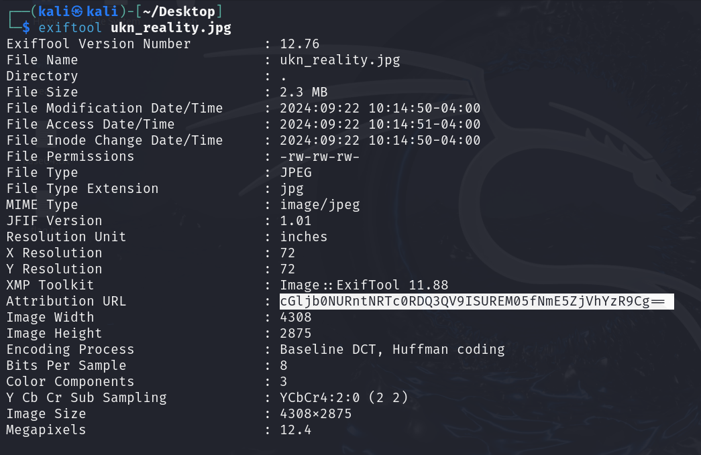
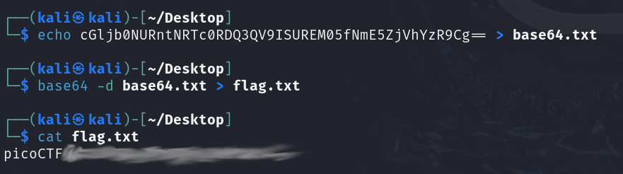

# CanYouSee
## Challenge tags:
- Easy
- Forensics
- picoCTF 2024
- browser_webshell_solvable

## Challenge author: MUBARAK MIKAIL
## Challenge description:
How about some hide and seek?

## Solution
Our object is a **.jpg** image. Lets begin analysis.
First, lets check metadata. Interesting string right here - as you may propably know, its a base64 encoding. 

Lets decode it and print our flag. 

