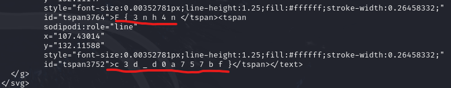
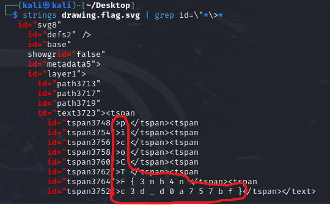

# Enhance!
## Challenge tags:
- Medium
- Dorensics
- picoCTF 2022
- svg

## Challenge author: LT 'syreal' Jones
## Challenge description:
Download this image file and find the flag.

## Solution
Lets begin with checking what type of file we are dealing with:
~~~bash
file drawing.flag.svg
~~~
And now we know that .svg is a image, but there is no glag after opening it. We have to investigate further - use exiftool to view metadata.
~~~bash
exiftool drawing.flag.svg
~~~
And still nothing.

There is also other possibility, **strings** command which will extract all strings from the file.
~~~bash
strings drawing.flag.svg
~~~
At the first look, there is nothing interesting. However, one thing got my attention and it was almost at the end. Take a look:

Doesn't it look like a part of the flag? Lest use grep to see simmilar lines.
~~~bash
strings drawing.flag.svg | grep id=\"*\>*
~~~

Bingo!
