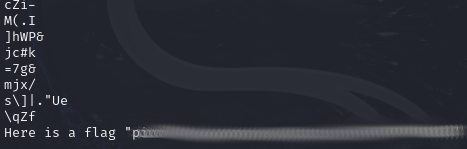

# Glory of the Garden
## Challenge tags:
- Easy
- Forensics
- picoCTF 2019

## Challenge author: jedavis/Danny
## Challenge description:
This garden contains more than it seems.

## Solution
This time we are dealing with image. There is nothing presented on the image, so we need to dig a little bit. Lets check metadata first.

Nothing interesting in there. We can use **binwalk** to see are there any hidden files in this image.

Still nothing. Lets check are there any hidden strings in this image:

~~~bash
strings garden.jpg
~~~

And there it is.

