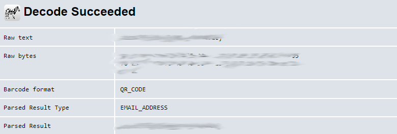
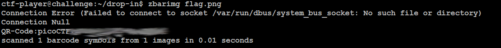

# Scan Surprise
## Challenge tags:
- Easy
- Forensics
- picoCTF 2024
- shell
- browser_webshell_solvable
- qr_code

## Challenge author: JEFFERY JOHN
## Challenge description:
I've gotten bored of handing out flags as text. Wouldn't it be cool if they were an image instead?


## Solution
In this challenge, our job is to decode a qr code. We can get it in 2 ways:
- downloading it
- using SSH and trying to decode qr code in linux terminal.

## 1)Downloading file
After unpacking .zip archive, we have our flag.png file.
All we need to do, is use our phone or web browser to decode it. You can use whatever you want, in my case it will be [this site](https://zxing.org/w/decode.jspx)

And we have our flag. Easy, right?



## 2)Using SSH
We are provided with username, server address and password to login through SSH protocol. I recommend using Putty on Windows and simple ssh command if you work in Linux terminal.

After listing what directory contains, we have one file - flag.png

To decode it, simply use command which is already installed on remote system:

```bash
zbarimg "flag.txt"
```



Thats it. 


