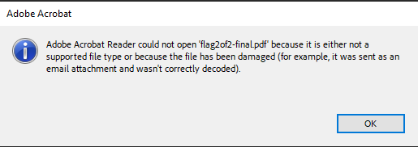
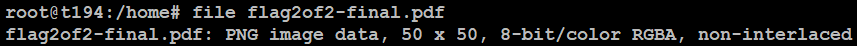
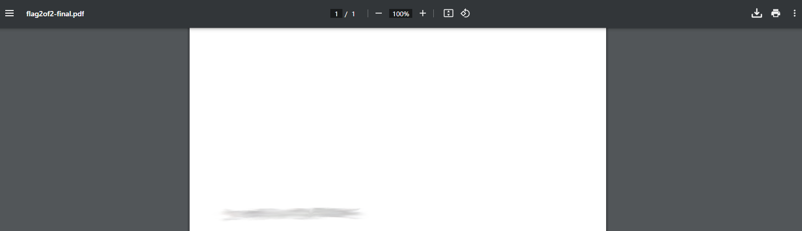

# Secret of the Polyglot
## Challenge tags:
- Easy
- Forensics
- picoCTF 2024
- file_format
- polyglot

## Challenge author: SYREAL
## Challenge description:
The Network Operations Center (NOC) of your local institution picked up a suspicious file, they're getting conflicting information on what type of file it is. They've brought you in as an external expert to examine the file. Can you extract all the information from this strange file?

## Solution
Download the file. We can see that have a .pdf extension, so we should try to open it with Adobe Acrobat or just a web browser. 

To figure out what file type is our file, we can use commant **file** in linux. 

As you can see, our .pdf is a .png file. Lets change extension to .png and open it.

We have a part of flag. We should search for second one. Lets examine .pdf format a bit more. Adobe Acrobat was unable to open it, but web browser is. We have second part of our flag.

