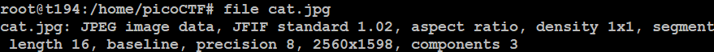
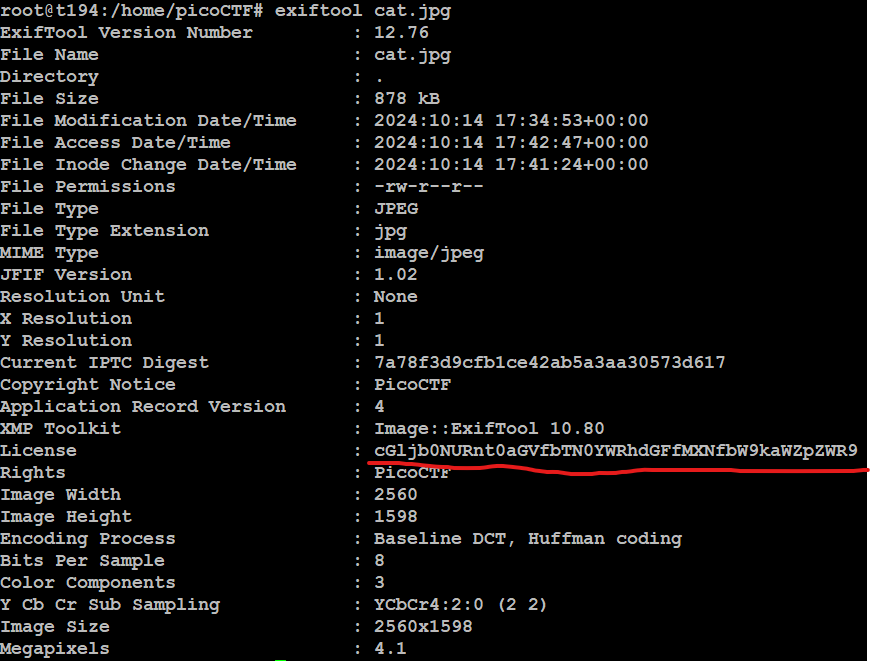

# information
## Challenge tags:
- Easy
- Forensics
- picoCTF 2021

## Challenge author: SUSIE
## Challenge description:
Files can always be changed in a secret way. Can you find the flag?

## Solution
We are provided with **cat.jpg** file. There is nothing interesting on the picture (except the cat). Lets begin our analysis.

**.jpg** is a correct file type, so changing it will be meaningless.

Maybe there is something interesting in metadata?

This look like a Base64 encoded string. Use [CyberChef](https://gchq.github.io/CyberChef/), select **From Base64**, paste this string. And thats it

