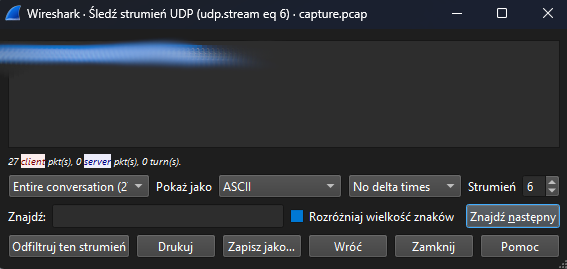

# shark on wire 1
## Challenge tags:
- Medium
- Forensics
- picoCTF 2019

## Challenge author: Danny
## Challenge description:
We found this packet capture. Recover the flag.

## Solution
We are dealing with captured network traffic. 

Wireshark will be required for this challenge. Lets sort whole traffic by protocol and start exploring:
- ARP: there are a lot of ARP requests in this file, every single one comes from 10.0.0.6, and only one is from 10.0.0.4. This might be clue
- BROWSER: nothing interesting there
- ICMPv6: nothing interesting there
- IGMPv6: nothing interesting there
- LLDP: nothing interesting there
- LLMNR: nothing interesting there
- MDNS: nothing interesting there
- SSDP: nothing interesting there
- TCP: nothing interesting there
- UDP/XML: nothing interesting there

It seems that i was looking in a wrong direction. After research, i found that we can follow protocol stream. Lets try this.

Analyze > follow > follow UDP stream. You can skip all streams until you will notice something like *picopicopico*. Next stream will be the flag.

