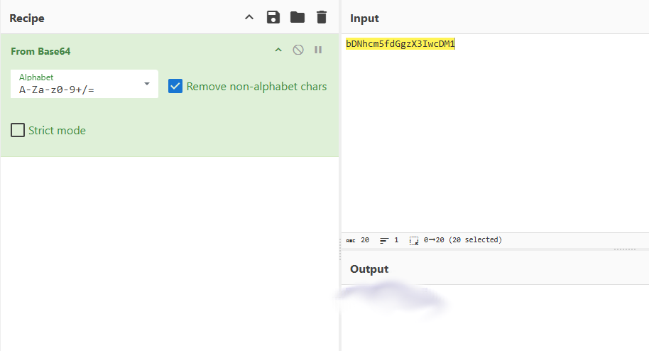

# Bases
## Challenge tags:
- Easy
- General Skills
- picoCTF 2019

## Challenge author: Sanjay C/Danny T
## Challenge description:
What does this **bDNhcm5fdGgzX3IwcDM1** mean? I think it has something to do with bases.

## Solution
We are dealing with encoded flag, author is suggesting that this is base **?** encoding. 

We will need a [CyberChef](https://gchq.github.io/CyberChef/).

In the search field, type in **from base**. You will see a list of different base decoding options. You can play and try every position from the list. If you dont want to waste your time - pick **from Base64**. 

Paste output between picoCTF{} and thats it. 

However

If you want to learn why do we even need base64 encoding, [this](https://youtu.be/p5DL-tQUhXk?si=mBLdLyhcRo3jXXGf) is a really great video explaining it.
