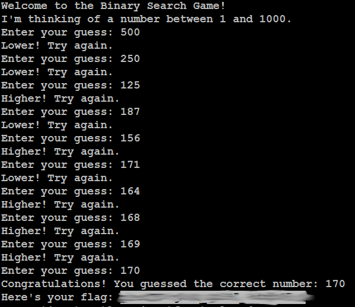

# Binary Search
## Challenge tags:
- Easy
- General Skills
- picoCTF 2024
- shell
- browser_webshell)solvable
- ls

## Challenge author: JEFFERY JOHN
## Challenge description:
Want to play a game? As you use more of the shell, you might be interested in how they work! Binary search is a classic algorithm used to quickly find an item in a sorted list. Can you find the flag? You'll have 1000 possibilities and only 10 guesses.
Cyber security often has a huge amount of data to look through - from logs, vulnerability reports, and forensics. Practicing the fundamentals manually might help you in the future when you have to write your own tools!

## Solution
As you can read from description, our job is to guess the number from 1 to 1000. We can try only 10 times. Sounds like impossible challenge which depend on our luck. But there is one thing - after we guess a number, program tells us that number is lower or higher. This change a lot because we can use Binary Search algorith. I recomment you watching [this quick and simple video](https://youtu.be/MFhxShGxHWc?feature=shared) about how this algorith works before you attempt this challenge.

There is nothing more i can tell you about this task. Connect to the remote shell using credits given in challenge and start guessing. 

My attempt looked like this:

