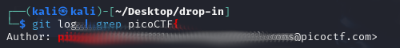

# Blame Game
## Challenge tags:
- Easy
- General Skills
- picoCTF 2024
- browser_webshell_solvable
- git

## Challenge author: Jeffery John
## Challenge description:
Someone's commits seems to be preventing the program from working. Who is it?

## Solution
We are probably looking for a guy who broke the program. Again we are dealing with git repository.

Lets use this command inside repository project:
~~~bash
git log
~~~

There are too much things to check by yourself. Lets use grep and get the flag.

