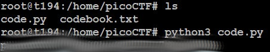

# Codebook
## Challenge tags:
- Easy
- General Skills
- Beginner picoMini 2022
- shell
- Python

## Challenge author: LT 'syreal' Jones
## Challenge description:
Run the Python script code.py in the same directory as codebook.txt.

## Solution
bruh

