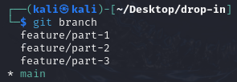
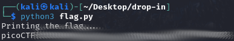

# Collaborative Development
## Challenge tags:
- Easy
- General Skills
- picoCTF 2024

## Challenge author: Jeffery John
## Challenge description:
My team has been working very hard on new features for our flag printing program! I wonder how they'll work together?

## Solution
Again we are dealing with git repository. Firstly, lets check whats inside flag.py:

Also, there is only 1 commit in main branch. Maybe there are other branches?

There are, and also containing 1 commit:
- part 1: +print("picoCTF{t3@mw0rk_", end='')
- part 2: +print("m@k3s_th3_dr3@m_", end='')
- part 3: +print("w0rk_7ffa0077}")

Lets put it all together using git merge, or simply add every line into flag.py

