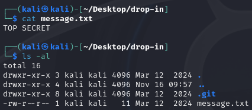
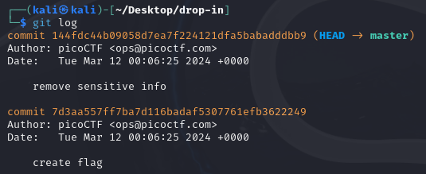
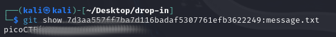

# Commitment Issues
## Challenge tags:
- Easy
- General Skills
- picoCTF 2024
- browser_webshell_solvable
- git

## Challenge author: Jeffery John
## Challenge description:
I accidentally wrote the flag down. Good thing I deleted it!

## Solution
Lets download this .zip archive and check what we are dealing with.

As you can see, there is a txt file, and a .git folder. We are dealing with git repository, so we should be able to check how **message.txt** was edited.

We have to copy commit hash, and use specific command to view previous content of our file.

~~~bash
git show <hash>:<path>
~~~

And thats it
