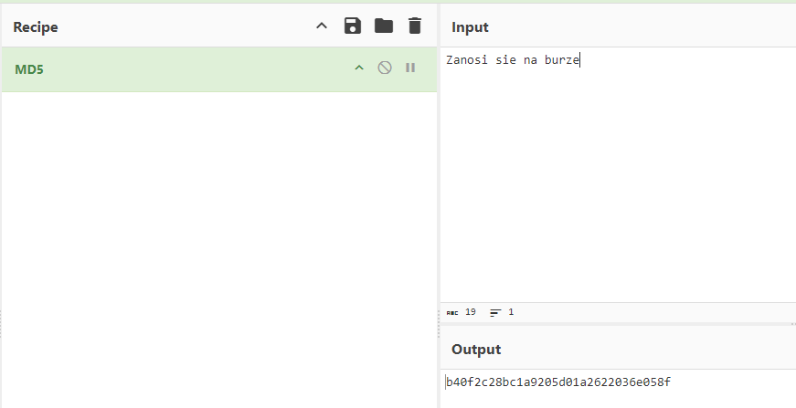
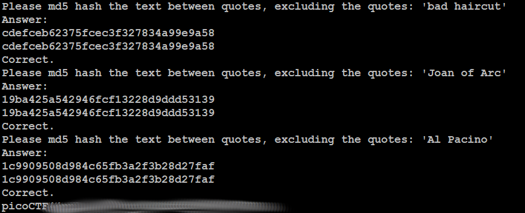

# HashingJobApp
## Challenge tags:
- Easy
- General Skills
- Beginner picoMini 2022
- hashing
- nc
- shell
- Python

## Challenge author: LT 'syreal' Jones
## Challenge description:
If you want to hash with the best, beat this test!

## Solution
Firstly, lets connet to the server using netcat.

We are asked to hash some **completly random things** with md5. Lets use [CyberCher](https://gchq.github.io/CyberChef/)

Paste result in terminal and repeat it few times. Every single time you will get a new string to hash, and you have a limited time to do it. Good luck 

