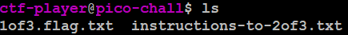
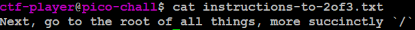
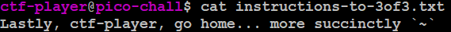

# Magikarp Ground Mission
## Challenge tags:
- Easy
- General Skills
- picoCTF 2021

## Challenge author: SYREAL
## Challenge description:
Do you know how to move between directories and read files in the shell? Start the container, `ssh` to it, and then `ls` once connected to begin. Login via `ssh` as **username** with the password, **password**

## Solution
Lets run the instance and connect through SSH. After using **ls** command, we see that there are two text files in current directory.

In the first one, there is first part of the flag. Lets check the second one. 

Use command **cd /** to get into this directory. After listing files, we see that there are two interesting text files: **20f3.flag.txt** and **instructions-to-3of3.txt**. Copy second part of the flag, and lets see instructions for the last one. 

Type **cd ~** or **cd home/ctf-player/** and use **ls** again. There is the third part of our flag. Thats all
