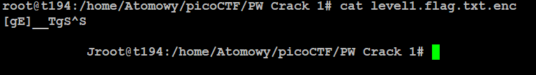
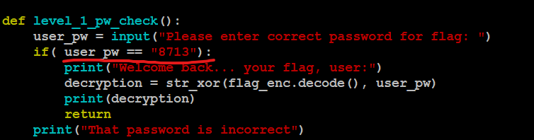

# PW Crack 1
## Challenge tags:
- Easy
- General Skills
- Beginner picoMini 2022
- password_cracking

## Challenge author: LT 'syreal' Jones
## Challenge description:
Can you crack the password to get the flag?
Download the password checker here and you'll need the encrypted flag in the same directory too.

## Solution
Lets verify first if flag is really encrypted. 

It is. Script **level1.py** ask us for password (which we dont know yet). Lets take a look at the source code:

As you can see, password is in this **if** statement. Use it after running script and get your flag. 
