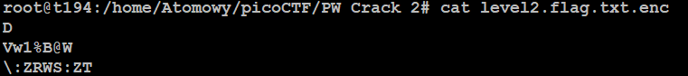
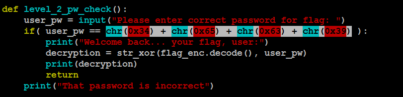
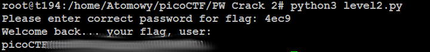

# PW Crack 2
## Challenge tags:
- Easy
- General Skills
- Beginner picoMini 2022
- password_cracking

## Challenge author: LT 'syreal' Jones
## Challenge description:
Can you crack the password to get the flag?
Download the password checker here and you'll need the encrypted flag in the same directory too.

## Solution
Firtstly lets see is the flag really encrypted. 

It is. Now we should check this python script. It's asking us for password, so we should have to bypass password od break it. 

Lets take a look at the source code.

This function is checking if entered password match those highligted chars. If you dont know what it is - its a hex notation. Quick example below:

chr(0x66) means char that stands for hex value equal 66. (in this case its "B")

So lets get our password:
 - 0x34 = 4
 - 0x65 = e
 - 0x63 = c
 - 0x39 = 9

Now lets try this password.

And thats it.

