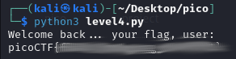

# PW Crack 4
## Challenge tags:
- Medium
- General Skills
- Beginner picoMini 2022
- password_cracking
- hashing

## Challenge author: LT 'syreal' Jones
## Challenge description:
Can you crack the password to get the flag?
Download the password checker here and you'll need the encrypted flag and the hash in the same directory too.
There are 100 potential passwords with only 1 being correct. You can find these by examining the password checker script.

## Solution
Can i crack the password? Yes

Do i want to? Nah, there is a faster way.

Lets modify the script.
~~~
"""BEFORE"""
def level_4_pw_check():
    user_pw = input("Please enter correct password for flag: ")
    user_pw_hash = hash_pw(user_pw)
    
    if( user_pw_hash == correct_pw_hash ):
        print("Welcome back... your flag, user:")
        decryption = str_xor(flag_enc.decode(), user_pw)
        print(decryption)
        return
    print("That password is incorrect")
 level_4_pw_check()

"""AFTER"""
def level_4_pw_check(hash):
    user_pw = hash
    user_pw_hash = hash_pw(user_pw)
    
    if( user_pw_hash == correct_pw_hash ):
        print("Welcome back... your flag, user:")
        decryption = str_xor(flag_enc.decode(), user_pw)
        print(decryption)
        return
    return

pos_pw_list = ['list here']
for hash in pos_pw_list:
    level_4_pw_check(hash)
~~~
Really fast and easy way to get the flag. You will find modified code [here](https://github.com/Atomowyy/picoCTF-writeup/blob/main/General%20Skills/PW%20Crack%204/level4_modified.py)

