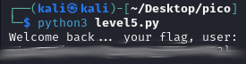

# PW Crack 5
## Challenge tags:
- Medium
- General Skills
- Beginner picoMini 2022
- password_cracking
- hashing

## Challenge author: LT 'syreal' Jones
## Challenge description:
Can you crack the password to get the flag?
Download the password checker here and you'll need the encrypted flag and the hash in the same directory too. Here's a dictionary with all possible passwords based on the password conventions we've seen so far.

## Solution
This is the final "PW Crack" challenge. We know that there is a **dictionary.txt** file with all possible combinations of password. To bruteforce this simple password checking script, we have to:
- import dictionary into list
- call function for every possible password.

### Importing dictionary
~~~python
dictionary = []
pswd_dict = open('dictionary.txt', 'r')
for line in pswd_dict:
    dictionary.append(line.strip())
pswd_dict.close()
~~~

### Modifying level_5_pw_check()
~~~python
def level_5_pw_check(pswd):
    user_pw = pswd
    user_pw_hash = hash_pw(user_pw)
    
    if( user_pw_hash == correct_pw_hash ):
        print("Welcome back... your flag, user:")
        decryption = str_xor(flag_enc.decode(), user_pw)
        print(decryption)
        return

for pswd in dictionary:
    level_5_pw_check(pswd)
~~~

And thats it. You will find modified script [here](https://github.com/Atomowyy/picoCTF-writeup/blob/main/General%20Skills/PW%20Crack%205/level5_modified.py)

