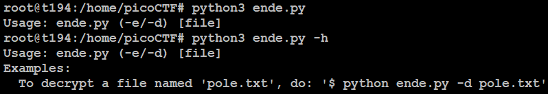

# Python Wrangling
## Challenge tags:
- Easy
- General Skills
- picoCTF 2021

## Challenge author: SYREAL
## Challenge description:
Python scripts are invoked kind of like programs in the Terminal... Can you run **this Python script** using **this password** to get the **flag**?

## Solution
We are provided with 3 files:
- **ende.py** - script
- **pw.txt** - password?
- **flag.txt.en** - encrypted flag

Lets try to run this script. 

We have to specify a encrypted file using **-d** flag. This time program ask us for password. Its insife **pw.txt** file, paste it and get the flag. 
