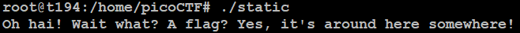
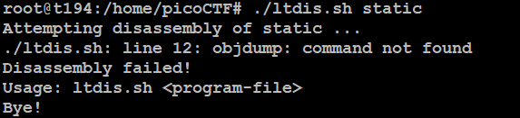

# Static ain't always noise
## Challenge tags:
- Easy
- General Skills
- picoCTF 2021

## Challenge author: SYREAL
## Challenge description:
Can you look at the data in this binary: static? This BASH script might help!

## Solution
Let's firstly analyze both files:
- **ltdis.sh** - BASH script
- **static** - ELF file

I tried to simply run ELF file, however: 

Its seems that in my case this script also will do completly nothing ;[

Its time to use **strings**, you will probably have to install it with:
~~~bash
apt-get install binutils
~~~

Then you can simply get the flag with this command:
~~~bash
strings static | grep picoCTF
~~~

I found that installing **binutils** fixed this script, so running it will work this time.

