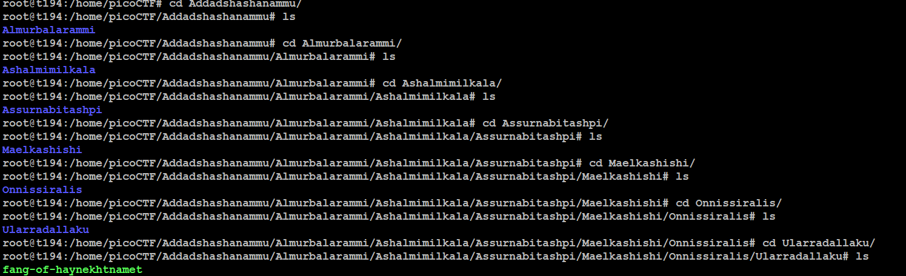

# Tab, Tab, Attack
## Challenge tags:
- Easy
- General Skills
- picoCTF 2021

## Challenge author: syreal

## Challenge description:
Using tabcomplete in the Terminal will add years to your life, esp. when dealing with long rambling directory structures and filenames

## Solution
Firstly, lets unzip that **Addahsuechwch39whc3v3r etc.zip** archive. You can use **unzip** command (install it if required). Now time for explorig what was inside the archive. 

Now, we have to check what type of file we are dealing with. 

~~~bash
file fang-of-haynekhtnamet
~~~

As you will notice, its a ELF file. We should execute it. 

~~~bash
./fang-of-haynekhtnamet
~~~

And thats it, we have the flag.
