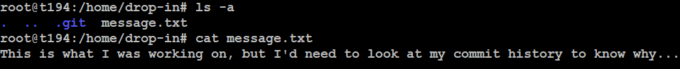

# Time Machine
## Challenge tags:
- Easy
- General Skills
- picoCTF 2024
- browser_webshell_solvable
- git

## Challenge author: JEFFERY JOHN
## Challenge description:
What was I last working on? I remember writing a note to help me remember...

## Solution
Firstly, download and unpack zip archive. We have only one directory in it so lets enter it. 
This txt file is telling us that we should check git history. 

Enter next directory. Those 2 files with upper-case in their names looks interesting. Print first one, and thats it. Flag is inside

