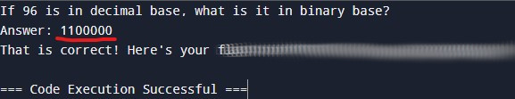
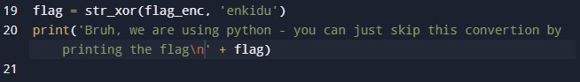

# convertme.py
## Challenge tags:
- Easy
- General Skills
- Beginner picoMini 2022
- base
- Python

## Challenge author: LT 'syreal' Jones
## Challenge description:
Run the Python script and convert the given number from decimal to binary to get the flag.

## Solution
Description is asking us to run the script. So lets run it. Again, you can use [this online interpreter](https://www.programiz.com/python-programming/online-compiler/)

Convert given number to binary notation in order to receive the flag.

But is it required? Nah, there is another way

