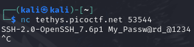

# dont-you-love-banners
## Challenge tags:
- Medium
- General Skills
- picoCTF 2024
- shell
- browser_webshell_solvable

## Challenge author: Loic Shema / syreal
## Challenge description:
Can you abuse the banner?

## Solution
After running the challenge, we see remote server, but with 2 ports. Lest try connect to the first one using netcat.

That *My_Passw@rd_@1234* is definitely a password for something. Lest check the second port. We are asked for the password, the one from previous connection works. Then, we are asked about 2 things - google it out or copy from below:

What is the top cyber security conference in the world?
~~~
DEF CON
~~~
The first hacker ever was known for phreaking(making free phone calls), who was it?
~~~
John Draper
~~~

Bingo, we have access to the shell. From the description, we know that we should look for a flag in **/root** directory.

There is a **flag.txt** file, however:

We have to login as root to see content of that file. We dont know the password, but we can crack it if we have access to specific files. Trying to print them will be succesfull:
- /etc/shadow
- /etc/passwd

Copy content of both files to your local machine, save as text files. Now we will be using **unshadow** utility of kali linux. This will combine both files.

~~~bash
unshadow passwd shadow > unshadowed
~~~

Delete all lines except the one with root user to save your time.

And now its time to use **hashcat** - powerfull tool for breaking hashes.

Make sure to prepare a **rockyou.txt** wordlist, its already in your **/usr/share/wordlists** directory if you are using Kali linux as i am. 

Run this command:
~~~bash
sudo hashcat -m 1800 unshadowed /usr/share/wordlists/rockyou.txt
~~~

You will quickly see this:

**iloveyou** is root password. How adorable.

Lets get back into remote server, use **su root** and enter the password. Then you will be able to print **flag.txt**.
