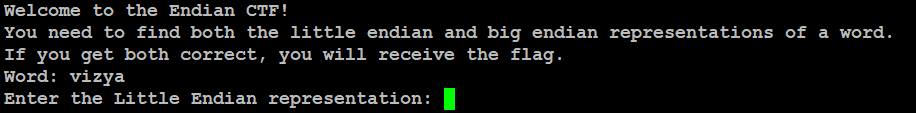
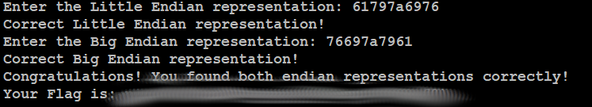

# endianness
## Challenge tags:
- Easy
- General Skills
- picoCTF 2024
- browser_webshell_solvable

## Challenge author: Nana Ama Atombo-Sackey
## Challenge description:
Know of little and big endian?

## Solution
This is extremely annoying challenge if you are uknown with ASCII representation. You can learn about big and little endian from [here](https://youtu.be/T1C9Kj_78ek?si=MUiFPKRCmBoS3i14)

Lets begin. Connect to the server using netcat.

First, we need to convert out word to hex notation, use ASCII table. In my case:
 - v = 76
 - i = 69
 - z = 7A
 - y = 79
 - a = 61

So our word in hex representation looks like this: 76697a7961
Little endian representation means, that LSB (least significant bit) is stored at the smallest memory address. Our word in little endian representation is 61797a6976

Big indian is reverse - 76697a7961

After pasting both representations you will get the flag. 

