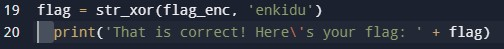

# fixme1.py
## Challenge tags:
- Easy
- General Skills
- Beginner picoMini 2022
- Python

## Challenge author: LT 'syreal' Jones
## Challenge description:
Fix the syntax error in the Python script to print the flag.

## Solution
For this challenge i recommend using online interpreter, for example [this one](https://www.programiz.com/python-programming/online-compiler/)

Let's try to run this script. We are receiving this error:

~~~
ERROR!
Traceback (most recent call last):
  File "<main.py>", line 20
    print('That is correct! Here\'s your flag: ' + flag)
IndentationError: unexpected indent

=== Code Exited With Errors ===
~~~
When we look at line 20, we see that is have spaces before it, this is not the python way ;[

Make print begin without spaces before it, and we can run the script again and receive our flag.
