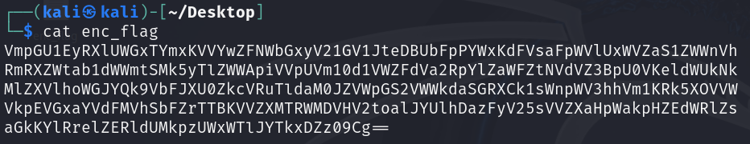
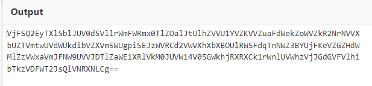
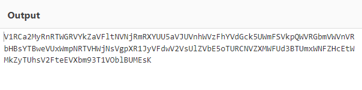
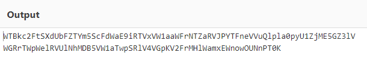
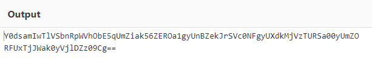

# repetitions
## Challenge tags:
- Easy
- General Skills
- picoCTF 2023
- base64

## Challenge author: THEONESTE BYAGUTANGAZA
## Challenge description:
Can you make sense of this file?

## Solution
Lets find some informations about this file - use **file** command if you are using linux. As you will find out, its just a text file. Lets check whats inside.  

Just a base64 thing. Prepare our base64 destroyer - [CyberChef](https://gchq.github.io/CyberChef/). Select **From Base64** and paste text from enc_file. 

Do that again

Again

And again 

[image missing?](https://tenor.com/pl/view/more-kylo-ren-adam-driver-screaming-star-wars-gif-17734637)

Repeat until you get the flag. 

