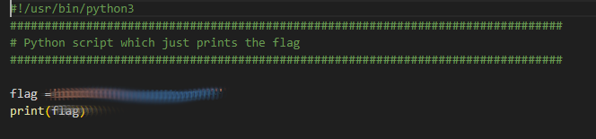

# runme.py
## Challenge tags:
- Easy
- General Skills
- Beginner picoMini 2022
- Python

## Challenge author: Sujeet Kumar
## Challenge description:
Run the runme.py script to get the flag. Download the script with your browser or with wget in the webshell.

## Solution
yes

