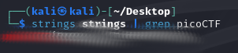

# strings it
## Challenge tags:
- Easy
- picoCTF 2019
- General Skills

## Challenge author: Sanjay C/Danny Tunitis
## Challenge description:
Can you find the flag in file without running it?

## Solution
Challenge name suggests us that we have to use **strings** command. This will extract all strings found in the file. 

~~~bash
#strings <filename> | grep <pattern>
strings strings | grep picoCTF
~~~

