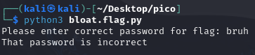
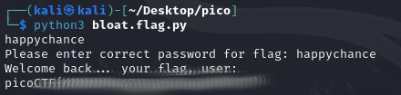

# bloat.py
## Challenge tags:
- Medium
- Reverse Engineering
- picoCTF 2022
- obfuscation

## Challenge author: LT 'syreal' Jones
## Challenge description:
Can you get the flag?
Run this Python program in the same directory as this encrypted flag.

## Solution
Lets begin with running the code. 

The scenario is simple - enter the password to get the flag. Lets take a look at the source code.

~~~python
def arg133(arg432):
  if arg432 == a[71]+a[64]+a[79]+a[79]+a[88]+a[66]+a[71]+a[64]+a[77]+a[66]+a[68]:
    return True
  else:
    print(a[51]+a[71]+a[64]+a[83]+a[94]+a[79]+a[64]+a[82]+a[82]+a[86]+a[78]+\
a[81]+a[67]+a[94]+a[72]+a[82]+a[94]+a[72]+a[77]+a[66]+a[78]+a[81]+\
a[81]+a[68]+a[66]+a[83])
~~~
Thats the only "if" statement in whole source code. We could use dictionary from 2nd line of the code, but for what? We can simply print the phrase that program expect us to enter.

Paste this below the dictionary. 
~~~python
print(f'{a[71]}{a[64]}{a[79]}{a[79]}{a[88]}{a[66]}{a[71]}{a[64]}{a[77]}{a[66]}{a[68]}')
~~~
Lets try this.

And there is our flag.
