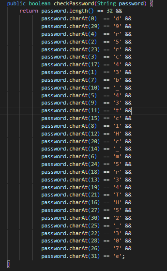

# vault-door-1
## Challenge tags:
- Medium
- Reverse Engineering
- picoCTF 2019

## Challenge author: Mark E. Haase
## Challenge description:
This vault uses some complicated arrays! I hope you can make sense of it, special agent.

## Solution
Let's take a look at the source code. You will quickly find this:

Probably we have to place chars in correct order.

After putting the result between picoCTF{here}, you will get the flag.
