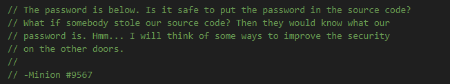
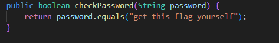
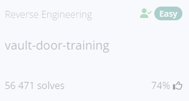

# vault-door-training
## Challenge tags:
- Easy
- Reverse Engineering
- picoCTF 2019

## Challenge author: MARK E. HAASE
## Challenge description:
Your mission is to enter Dr. Evil's laboratory and retrieve the blueprints for his Doomsday Project. 
The laboratory is protected by a series of locked vault doors. Each door is controlled by a computer and requires a password to open. 
Unfortunately, our undercover agents have not been able to obtain the secret passwords for the vault doors, 
but one of our junior agents obtained the source code for each vault's computer! 
You will need to read the source code for each level to figure out what the password is for that vault door. 
As a warmup, we have created a replica vault in our training facility. 
The source code for the training vault is here: VaultDoorTraining.java (you can get file from [picoCTF.org](https://picoCTF.org))

## Solution

I want to notice that i never used java, so this might be hard for me. 
At the begining, we should definitely check that .java file that author give us. You can open it in any code editor, in my case it will be Visual Studio Code.

We see a few lines of comment, lest see what informations programmer is providing us:

- Is it safe to put the password in the source code? **Definitely not**
- What if somebody stole our source code? **He can steal all the informations included in source code**

'The password is below'

Then lets check what is below that comment.

Is this our flag? Lets check it out
(dont forget to put flag in correct format: picoCTF{**flag**})

Yup, this was the flag. It wasn't to hard even without basic java knowledge, dont you think?

