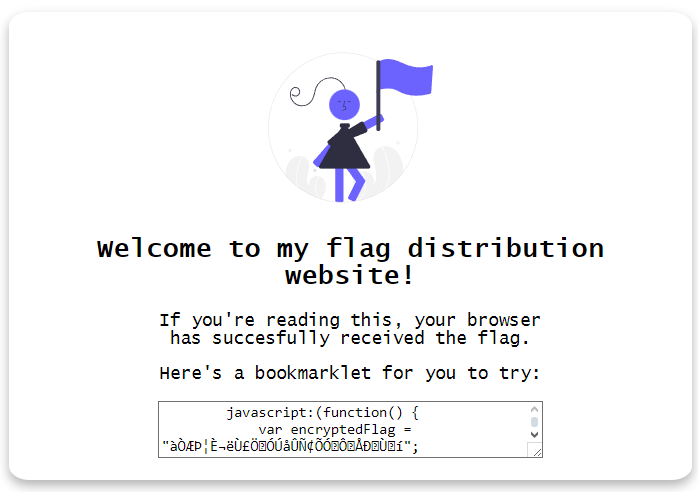
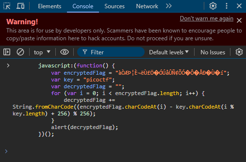

# Bookmarklet
## Challenge tags:
- Easy
- Web Exploitation
- picoCTF 2024
- obfuscation
- browser_webshell_solvable
- browser

## Challenge author: JEFFERY JOHN
## Challenge description:
Why search for the flag when I can make a bookmarklet to print it for me?

## Solution
Lets visit challenge website. We see a code which we have to run to obtain the flag: 

Lets copy it. Now, you have to find a way to execute this code - you can simply use the console built in your we browser. Press right mouse button -> inspect element -> switch to the console -> paste the code and press enter. Thats all

