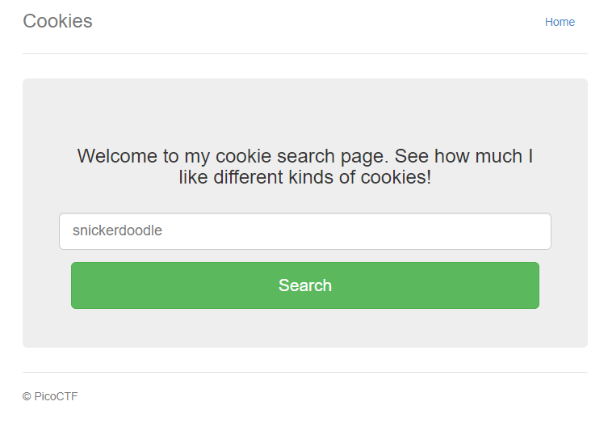
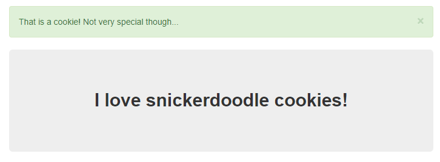

# Cookies
## Challenge tags:
- Easy
- Web Exploitation
- picoCTF

## Challenge author: madStacks
## Challenge description:
Who doesn't love cookies? Try to figure out the best one.

## Solution
Let's visit a website provided by author. 

Lets try to enter exactly the same value as suggestion.

Nothing really important happened, also there is nothing interesting in source code. 

We need to check **cookie files**. This is where the fun begins.

Open website inspection on your web browser. I found cookie files in chrome on **Application>Storage>Cookies**. There is a column named **value**, and whenever we change this value and refresh site, something different appears. 

If you want to experiment by yourself - try different Values.

If not - flag is under value **18**
