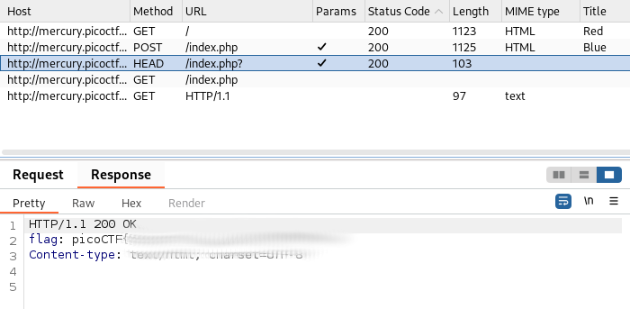

# GET aHEAD
## Challenge tags:
- Easy
- Web Exploitation
- picoCTF 2021

## Challenge author: madStacks
## Challenge description:
Find the flag being held on this server to get ahead of the competition

## Solution
This tittle is sugesting us that we should take a closer look at HTTP HEADER. Lets firstly check provided website.

We can see two buttons - **Choose Red** and **Choose blue**. Find a tutorial explaining how to view HTTP header in your web browser. Firstly, lets check **Choose red button**.

There is nothing interesting in HEADER. For blue button - still nothing. 

Maybe we should use BurpSuite to examine requests, or modify them. If you are unfamiliar with Burp, watch [this](https://youtu.be/IWWYNDiwYOA?si=XfPIxpJj5OmwCA_y)

I've noticed, that red button send **GET** method, and blue sends **POST**. Lets try to modify this using [other HTTP methods](https://developer.mozilla.org/en-US/docs/Web/HTTP/Methods).

After selecting **HEAD** method, check response from the server. Flag is there.

