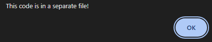

# Includes
## Challenge tags:
- Easy
- Web Exploitation
- picoCTF 2022
- inspector

## Challenge author: LT 'syreal' Jones
## Challenge description:
Can you get the flag?

## Solution
You should definitely open website (brilliant, i know). We see a few lines of text, and a button. Lets see what it does:

Now we know, that script responsible for button function comes from other file. Lets find it - press CTRL+U and look at the HTML code. We see included script called **script.js**. Lets open it in a new tab. 

Last line looks like a second part of the flag. We need to find first one. Lets get back to HTML and open **style.css**. And there it is.
