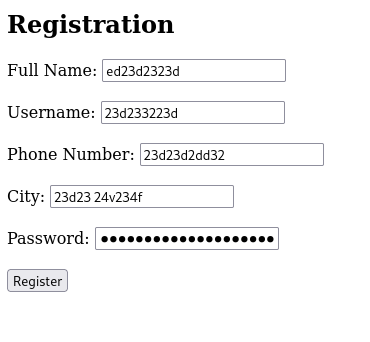
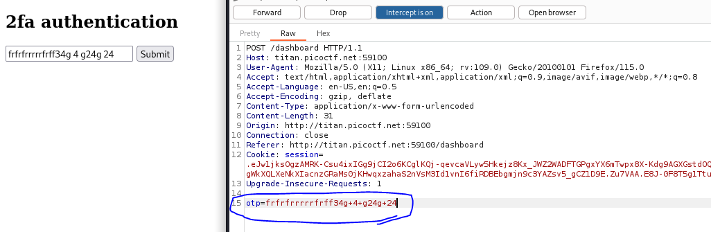

# IntroToBurp
## Challenge tags:
- Easy
- Web Exploitation
- picoCTF 2024

## Challenge author: NANA AMA ATOMBO-SACKEY & SABINE GISAGARA
## Challenge description:
[]

## Solution
Before attempting this challenge, make sure to setup proxy in your web browser to enable Burp Suite capture and modify http requests. If you are new to this kind of tasks - [this](https://youtu.be/IWWYNDiwYOA?si=zhKtr4aCRy8vza9f) will help you a lot. 

Lets check site provided in the challenge. 

We see a simple register form, lets enter random things and press button. Forward next two requests in burp. 

Now we see a OTP request, lets enter anything and press enter. As you can see, Burp will capture request, and all you have to do is removing otp line (in my case - 15). Thats it, you have the flag
