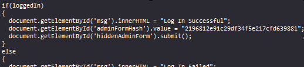
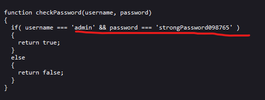

# Local Authority
## Challenge tags:
- Easy
- Web Exploitation
- picoCTF 2022
- inspector

## Challenge author: LT 'syreal' Jones
## Challenge description:
Can you get the flag? Go to this website and see what you can discover.

## Solution
We should definately check website available after launching challenge. 

Login panel is waiting for us there but lets check source code first. As i expected - flag will be our after loggin in 

Form on this site use post method, we could try to leak some informations from database. However, not gonna work because special chars are not allowed in this form. Lets take a look at **secure.js** script. 

Bingo.

Lets use those login credentials and get our flag. 

