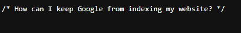

# Scavenger Hunt
## Challenge tags:
- Easy
- Web Exploitation
- picoCTF 2021

## Challenge author: MADSTACKS
## Challenge description:
There is some interesting information hidden around this site. Can you find it?

## Solution
Sure i can.

I've already done this kind of challenge, so read carefully:

- first part from the flag is in html file (RMB -> inspect)
- second part is at the bottom of .css file

Now things getting a bit more complicated. There is a question in .js file:

The answer is:

**robots.txt** file, you can view it by adding /robots.txt at the end of main site URL. 

Third part of the flag is ours, but its not the end. 

**"I think this is an apache server... can you Access the next flag?"**

And now you have to read through whole Apache documentation :))))))))))

Or paste .htaccess at the end of the url, get fourth part of our flag.

AND NOW 

**I love making websites on my Mac, I can Store a lot of information there.**

READ THROUG WHOLE MAC OS DOCUMENTATION =D

.DS_Store is what you are looking for.
