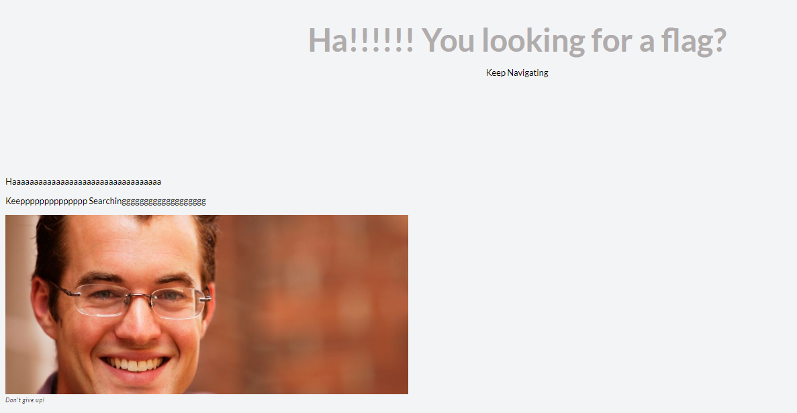
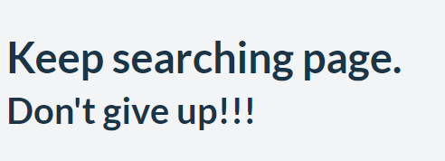
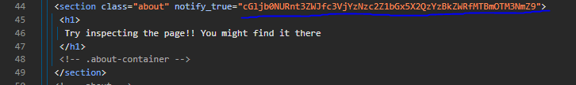
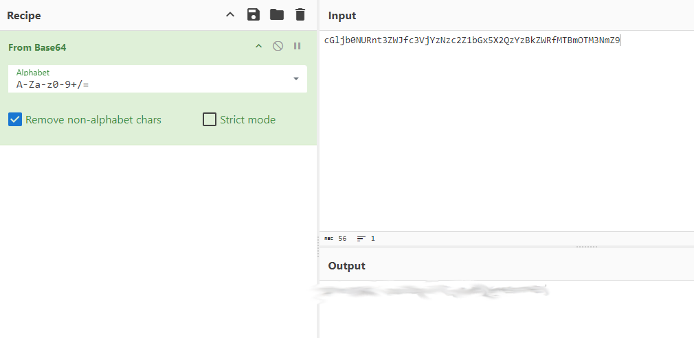

# WebDecode
## Challenge tags:
- Easy
- Web Exploitation
- picoCTF 2024
- browser_webshell_solvable

## Challenge author: NANA AMA ATOMBO-SACKEY
## Challenge description:
Do you know how to use the web inspector?

## Solution
In this challenge, author give us a website. Lets enter it. 

Default page looks like this:

Lets check two other sites: 

contact.html:

about.html: 

We definitely have to check source code. There is nothing interesting, except this section:

This looks like a encoded flag. String lenght looks like its a Base64. We have to decode it. Lets use (CyberChef)[https://gchq.github.io/CyberChef/]. In left panel, select and drag **From Base64** to our recipe. Paste encoded string, and thats it.

