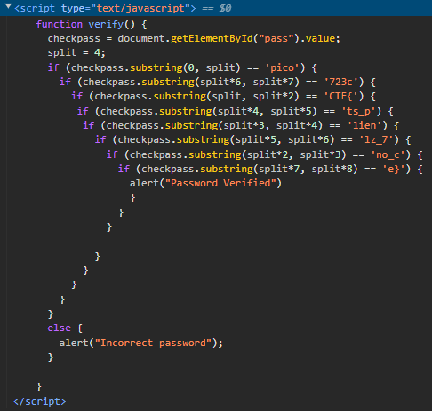

# dont-use-client-side
## Challenge tags:
- Easy
- Web Exploitation
- picoCTF 2019

## Challenge author: Alex Fulton/Danny
## Challenge description:
Can you break into this super secure portal? (URL)

## Solution
Lets visit this super secure site. There is a beautifull yellow box asking us for valid credentials. After typing anything, we will receive a warning about incorrect password.

Lets examine how does this site validate password. There is an interesting script in the source code.

I guess thats our flag, but we have to put it together first. 

~~~js
function verify() {
    checkpass = document.getElementById("pass").value;
    split = 4;
    if (checkpass.substring(0, split) == 'pico') {                          //1st
      if (checkpass.substring(split*6, split*7) == '723c') {                //7th
        if (checkpass.substring(split, split*2) == 'CTF{') {                //2nd
         if (checkpass.substring(split*4, split*5) == 'ts_p') {             //5th
          if (checkpass.substring(split*3, split*4) == 'lien') {            //4th
            if (checkpass.substring(split*5, split*6) == 'lz_7') {          //6th
              if (checkpass.substring(split*2, split*3) == 'no_c') {        //3rd
                if (checkpass.substring(split*7, split*8) == 'e}') {        //8th
                  alert("Password Verified")
                  }
                }
              }
      
            }
          }
        }
      }
    }
    else {
      alert("Incorrect password");
    }
    
  }
~~~

And thats it.
