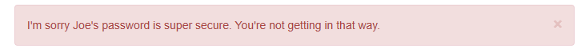
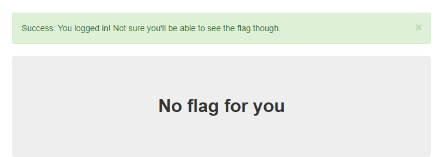

# logon
## Challenge tags:
- Easy
- Web Exploitation
- picoCTF 2019

## Challenge author: bobson
## Challenge description:
The factory is hiding things from all of its users. Can you login as Joe and find what they've been looking at?

## Solution
Lets visit this site and see what they have prepared for us.

There is a login site. From the description, we know that we have to log into Joe's account. Lets try **Joe** and password **1234**

This thing pops up. Lets try something more advanced ;] (**admin admin**)

There is no flag for us. I have played with this login site a little bit, and i found out that no matter what you type in - you are **"logged"** in. Site returns error only when i try to login as **Joe**.

There has to be a script responsible for it. Source code have nothing interesting in it. Lets take a look at cookies. 

You will find one called **admin** with **False** value. Change it to true and refresh site. There is our flag. 

