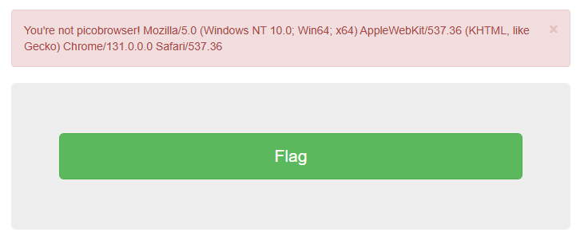
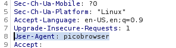

# picobrowser
## Challenge tags:
- Medium
- Web Exploitation
- picoCTF 2019

## Challenge author: Archit
## Challenge description:
This website can be rendered only by picobrowser, go and catch the flag!

## Solution
There is no "picobrowser" to download. There must be other way to render this website. But first let's take a look at the site.

Its seems that server is checking our request header, there is a parameter called **User-Agent**, which tells a lot of informations about browser and more. 

Lets try to modify request using burpsuite.

Change your **User-Agent** to look like this, and forward the request. Flag is yours.

