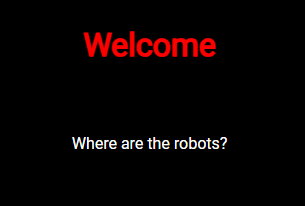
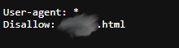

# where are the robots

# Challenge tags:
-Easy
-Web Exploitation
-picoCTF 2019

# Challenge author: ZARATEC/DANNY
# Challenge description:
Can you find the robots?
[yes, thats all]

#Solution
First we need to visit a website from desription. 
All we see are two text lines, and nothing more. 

Maybe there is something interesting in source code? 
Unfortunately there are no tracks of any hint.

A website is asking us where are the robots, but what robots?
Let's find out (by using web browser, because why not).

After searching for "http robots", i found a [google developer page](https://developers.google.com/search/docs/crawling-indexing/robots/intro) desribing a file "robots.txt", maybe thats what we are looking for?

So what is robots.txt?
It is a file used for implementing "REP (Robots Exclusion Protocol)" which portions of a website web crawlers (or other kind of web robots) are allowed to visit.
If you want to learn about it, visit link given before. If you prefer to watch a video, [this](https://youtu.be/qRlQ965pGCA?si=fnTGiyE2az9E3W8O) might be usefull.

Getting back to our CTF task, lets view the robots.txt file by adding /robots.txt at the end of URL.

We can see that web crawlers are not able to visit ?????.html. But we are not web crawlers ;]

Replace /robots.txt with /?????.html 

And bingo, we found the robots
